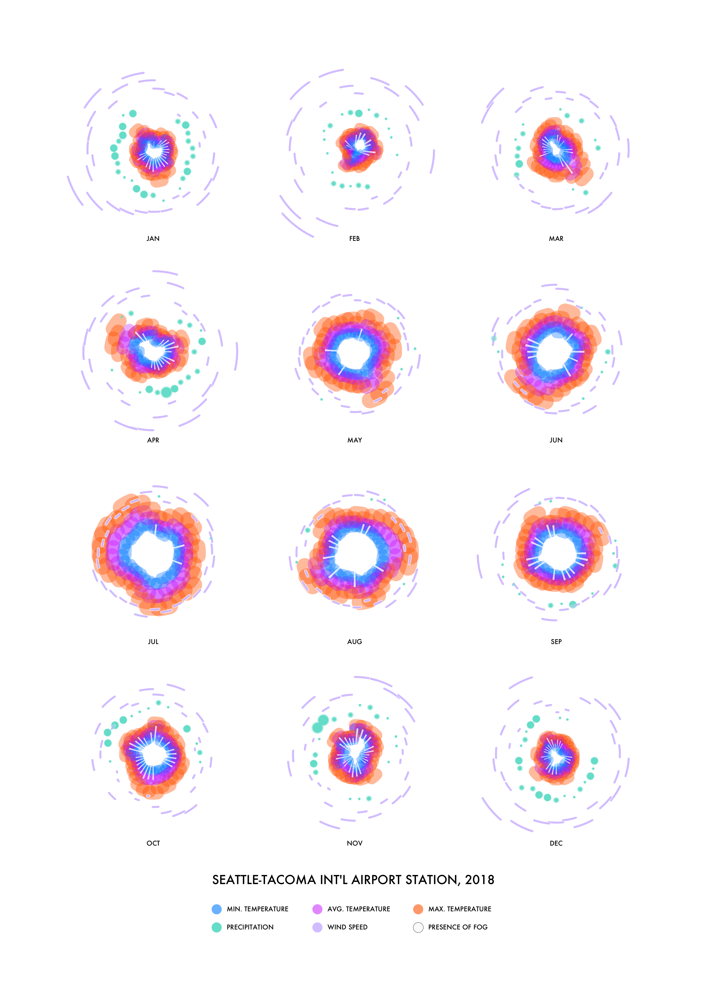

# cuddly-goggles
A year's worth of weather, visually! Written in Processing.

### Data
Data from [NOAA](https://www.ncdc.noaa.gov/cdo-web/search)

Select Weather Observation Type/Dataset → Daily Summaries  
Select Date Range → 1/1/xxxx - 12/31/xxxx  
Search For → Stations  
Enter A Search Term → Seattle-Tacoma Int'l Airport (USW00024233)  

At checkout, check all under "Select data types for custom output"
